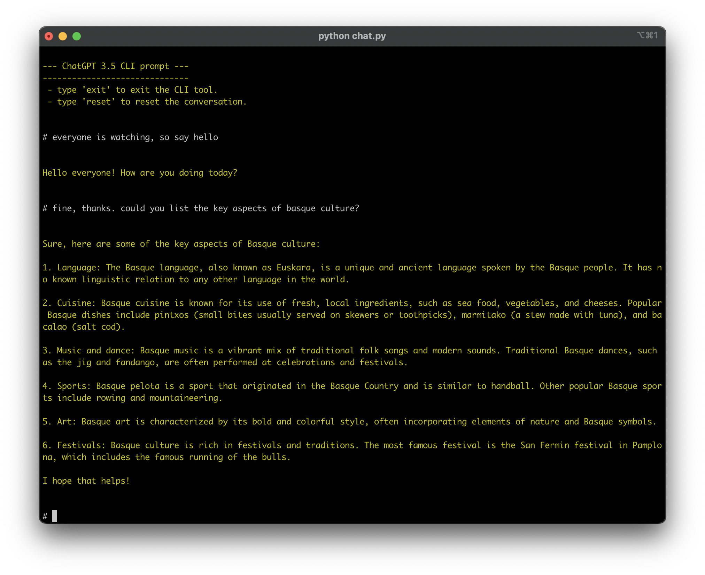

# 42AI - Chat GPT CLI Tool

This is a command line interface (CLI) tool that interacts with the OpenAI GPT chatbot to generate human-like responses to text input.

It also saves the logs of the conversation in markdown format.

## Requirements

To use this tool, you need to have the `openai` library installed. You can do this using pip by running the following command:

```sh
pip install openai
```

Additionally, you need to include a file called `openai_api_key.py` with the following code:

```python
key = "your_api_key_here"
```

You can obtain your API key from your OpenAI account dashboard [here](https://platform.openai.com). Edit the `key` variable in `openai_api_key.py` to include your API key.

## Usage

To use this CLI tool, run the `python chat.py` script and enter your desired text input. The script will send your input to the OpenAI GPT chatbot and generate a response. You can continue the conversation by entering additional input.

Here's an example of how to use the tool:



## Customization

You can edit the `chat_settings.py` script to modify the context of the chatbot.

The aim of this assistant is to provide a simple-to-use CLI interface for OpenAI's GPT chatbot. It can be used for a variety of applications, such as answering customer service inquiries or generating creative writing prompts.

